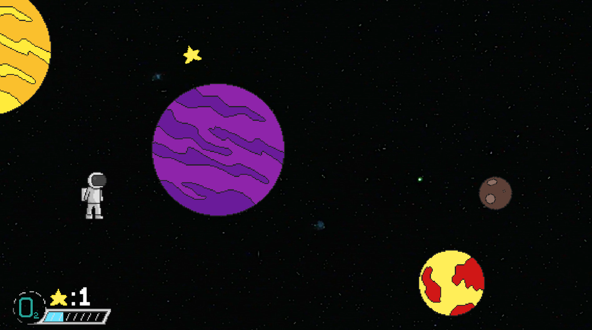

# Cosmitide
Arcade-survival game that you control with a single button and test how long you can last among the stars.  
Your goal is to survive as long as possible while dodging planets of diferent sizes that appear randomly and manage oxygen supply

## About ProtoLab
### What is ProtoLab
ProtoLab is a collection of small videogame prototypes based on specific themes.  
Think of it as a _Game Jam-like projects_, but mainly dessigned for **practice and experimentation**

## Current ProtoLab
> **Theme:** _Space_  
> **Schedule:** Sep 22, 2025 -> Sep 28, 2025  
> **Status:** Playable

### Game Modes
Originally was planned to have 3 different game modes, but due lack of time and some unforeseen events, could only include one.   
_Planned Gamemodes:_
- **Classic** (Done)  
> Survive as long as you can or until you run out of oxygen. Collect as many stars as possible while dodging randomized planets!  

- **Gravity** (Planned for future releases)
> Same as Classic, but now you don't need to worry about running out of oxygen Instead, focus on avoiding the gravity of the planets  
- **Orbit** (Planned for future releases)
> You found yourself orbiting a planet, Dodge meteorites, orbiting moons, collect stars and survive as long as you can without crashing into the planet or drifting out of orbit  

**Note**: While these modes are planned for future versions, there's no guarantee they'll be completed. ProtoLab has deadlines to transition into new projectss, but with free time between them, I may continue working on these aditional modes

## How to Play
Available on [itch.io](https://davender-sparkle.itch.io/cosmotide)